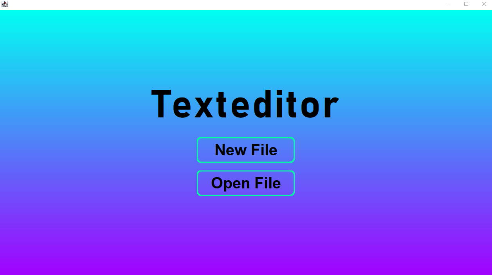
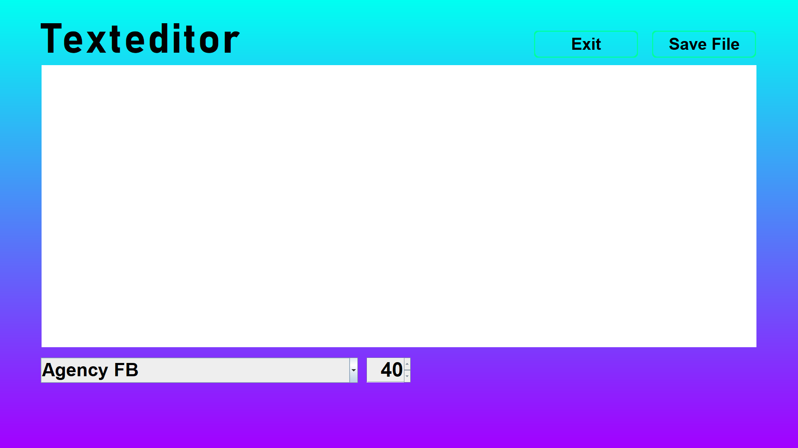

# Texteditor
Ein kleiner Texteditor, welchen ich als kleines Nebenprojekt gemacht habe. Die im Texteditor eingestellten Schriftarten und Schriftgrößen werden nicht in der .txt-Datei gespeichert! Leider ist die GUI nicht resizable, daher wechselt der Texteditor auch in Full Screen beim Starten. Jedoch werde ich dieses vielleicht Feature bald implementieren. Der Texteditor kann jede Datei, die Textdaten enthält öffnen und speichern, oder auch selber eine .txt-Datei erstellen und diese dann speichern.
Das Startmenü sieht wie folgt aus:

Der Texteditor selber sieht so aus. Diese Ansicht ist für beide Optionen gleich(New File/Open File).

